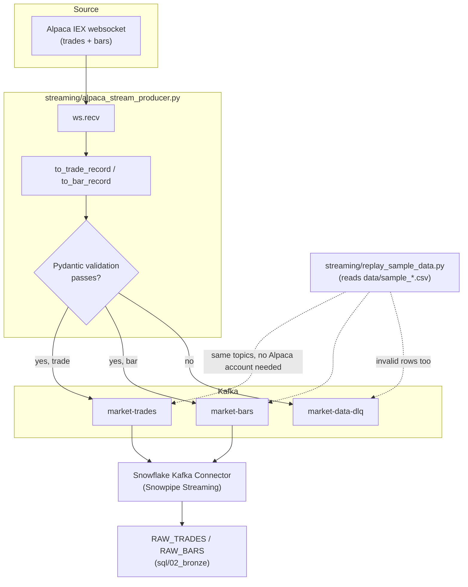
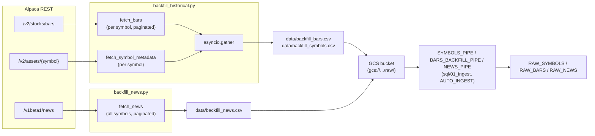
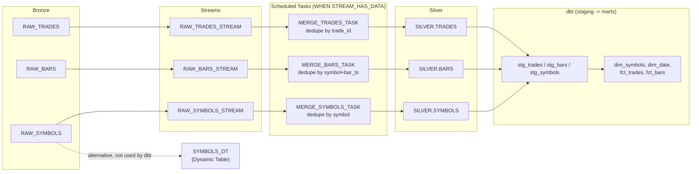
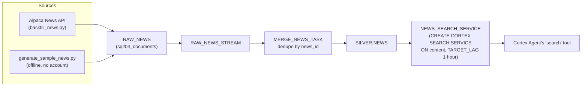
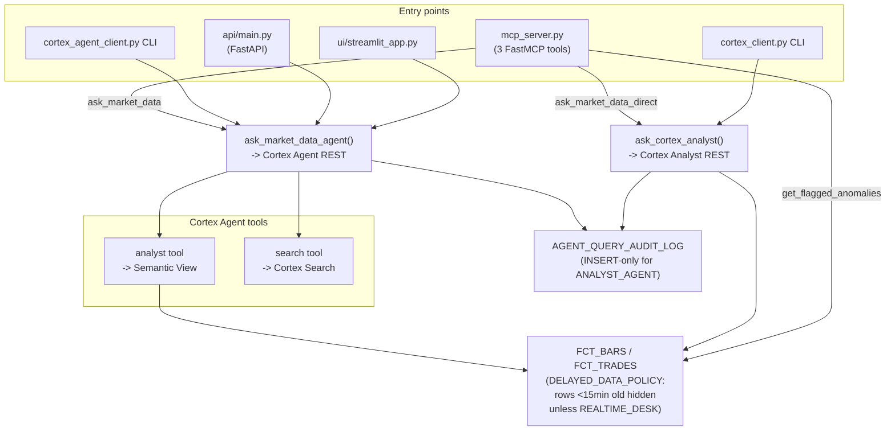
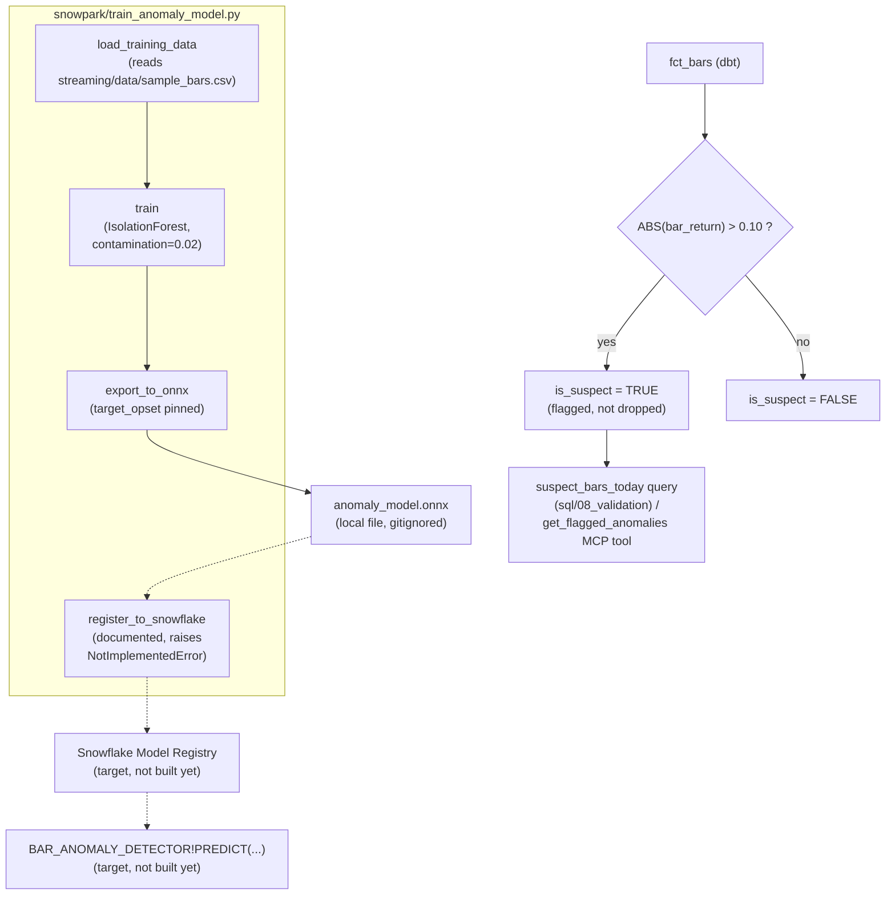

# Snowflake AI Data Agent

Ingests real-time U.S. equities trades, minute bars, and financial news into
Snowflake, transforms them into a governed star schema and a document search
index, and exposes both to a natural-language AI agent through five
interchangeable entry points (direct Cortex Analyst, a multi-tool Cortex
Agent, an MCP server, a Streamlit chat UI, and a FastAPI HTTP layer). Every
entry point is subject to the same Row Access Policy, so the agent can never
see a real-time price it isn't licensed to show, and every answer it gives
has either a hand-written SQL check or a source citation behind it.

**Status: in development.** All SQL, dbt, and Python in this repo is written
and locally verified where that's possible without an account (see
[Feature status](#feature-status)), but none of it has been run against a
live Snowflake account, Kafka broker, GCS bucket, or Alpaca connection yet.

---

## Repository structure

```
snowflake-ai-data-agent/
├── sql/
│   ├── 01_ingest/
│   │   └── snowpipe_setup.sql          # GCS storage integration, stage, batch pipes (symbols/bars/news)
│   ├── 02_bronze/
│   │   └── bronze_tables.sql           # RAW_TRADES, RAW_BARS, RAW_SYMBOLS (permissive VARCHAR typing)
│   ├── 03_silver/
│   │   ├── streams_and_tasks.sql       # Streams + scheduled MERGE Tasks -> SILVER.TRADES/BARS/SYMBOLS
│   │   └── dynamic_tables_alternative.sql  # SYMBOLS_DT: same output, Dynamic Table instead (not wired in)
│   ├── 04_documents/
│   │   └── documents_and_search.sql    # RAW_NEWS -> SILVER.NEWS -> Cortex Search Service
│   ├── 07_governance/
│   │   └── rbac_and_masking.sql        # roles, grants, DELAYED_DATA_POLICY (row access policy)
│   ├── 08_validation/
│   │   └── validation_queries.sql      # hand-written SQL twin of every semantic-model verified_query
│   ├── 09_guardrails/
│   │   └── cost_and_access_guardrails.sql  # ANALYST_WH, resource monitor, audit log table
│   └── 10_agent/
│       └── cortex_agent.sql            # CREATE AGENT: routes between analyst and search tools
├── streaming/                          # ingestion producers/backfillers, Python
│   ├── schemas.py                      # Pydantic: TradeRecord, BarRecord, SymbolRecord, NewsRecord
│   ├── alpaca_stream_producer.py       # live: Alpaca websocket -> Kafka (+ DLQ on validation failure)
│   ├── replay_sample_data.py           # offline: replays sample CSVs onto the same Kafka topics
│   ├── generate_sample_data.py         # generates data/sample_{bars,trades,symbols}.csv
│   ├── generate_sample_news.py         # generates data/sample_news.csv
│   ├── backfill_historical.py          # batch: Alpaca REST bars/assets -> CSV (async, per symbol)
│   ├── backfill_news.py                # batch: Alpaca News API -> CSV (async, per symbol)
│   ├── snowflake_kafka_connector.json  # Kafka Connect sink config (Snowpipe Streaming mode)
│   └── data/                           # checked-in sample CSVs only; live/backfill output is gitignored
├── agent/                              # query-time clients, Python
│   ├── schemas.py                      # Pydantic request/response contracts (distinct from streaming/schemas.py)
│   ├── cortex_client.py                # direct Cortex Analyst REST call (YAML semantic model)
│   ├── cortex_agent_client.py          # Cortex Agent REST call (routes analyst vs. search)
│   └── mcp_server.py                   # FastMCP server: 3 tools wrapping the two clients above
├── snowpark/
│   └── train_anomaly_model.py          # IsolationForest -> ONNX; Model Registry registration documented, not run
├── ui/
│   └── streamlit_app.py                # chat UI over cortex_agent_client.ask_market_data_agent
├── api/
│   └── main.py                         # FastAPI: /health, /ask, /ask/analyst-only
├── dbt/
│   ├── dbt_project.yml                 # project name is stale ("retail_agent_gold") -- see docs/restructure-proposal.md
│   ├── profiles.yml.example            # copy to ~/.dbt/profiles.yml
│   ├── models/staging/                 # 1:1 views over Silver: stg_trades, stg_bars, stg_symbols
│   ├── models/marts/                   # Gold star schema: dim_symbols, dim_date, fct_trades, fct_bars
│   └── tests/assert_bar_ohlc_consistency.sql  # singular test: fails `dbt test` on bad OHLC data
├── semantic_layer/
│   ├── semantic_model.yaml             # Cortex Analyst YAML (custom window-function metrics)
│   └── semantic_view.sql               # native CREATE SEMANTIC VIEW (what Cortex Agents/MCP query)
├── requirements.txt                    # single flat file for the whole repo's Python deps
└── docs/
    ├── PORTFOLIO_BRIEF.md              # reasoning history behind domain/architecture decisions
    ├── agent-and-governance-flow.md    # deep dive on the flow with the most entry points
    └── restructure-proposal.md         # suggested layout changes -- proposals only, not applied
```

---

## Flows

### 1. Real-time ingestion



The producer and the offline replay script are interchangeable inputs to the same two Kafka topics — nothing downstream (the Connector, Bronze, Silver) can tell which one is running.

**Validation is the gate, not an afterthought.** Every message is parsed into a `TradeRecord` or `BarRecord` (`streaming/schemas.py`) before it reaches Kafka. A `BarRecord` failing `ohlc_is_internally_consistent` (high below low, high below open/close, low above open/close) or either record having a non-positive price never reaches `market-trades`/`market-bars` — it's re-serialized with its error message and sent to `market-data-dlq` instead, in both the live producer and the replay script.

**Reconnection**: `alpaca_stream_producer.run` is wrapped in `@retry(retry_if_exception_type(ConnectionClosed), wait_exponential(...), stop_after_attempt(10))` — a dropped websocket retries with exponential backoff up to 10 times rather than exiting.

**Status: Partial.** The code is complete and the offline path was run locally (see Feature status), but the live path has not been connected to a real Alpaca feed or a real Kafka broker.

---

### 2. Batch backfill (history + news)



**Why async**: `backfill_historical.py` fetches bars and asset metadata for every symbol concurrently via `asyncio.gather`, one task per symbol per endpoint, instead of looping sequentially — the same pattern repeats in `backfill_news.py` for the News API.

*Retry*: both `fetch_bars` and `fetch_news` are wrapped in `tenacity`'s `wait_exponential`/`stop_after_attempt(5)`, so a transient 5xx doesn't abort the whole backfill.

*Upload is manual*: neither script uploads to GCS itself — both print a reminder that the operator uploads the CSV to trigger the pipe's `AUTO_INGEST`. There is no code path that does this automatically.

**Status: Stubbed.** Both scripts run and produce correctly-shaped output against Alpaca's real API (not verified in this session — no Alpaca key available), but the GCS upload step and the pipe auto-ingest have not been exercised end-to-end.

---

### 3. Bronze → Silver → Gold transformation



Each Task dedupes by taking the latest row per natural key (`QUALIFY ROW_NUMBER() OVER (... ORDER BY _loaded_at DESC) = 1`) and casts Bronze's permissive `VARCHAR` columns to real types (`TRY_TO_DECIMAL`, `TRY_TO_TIMESTAMP_NTZ`, etc.) before the `MERGE`.

**`fct_bars` computes two derived columns in SQL**, not just a passthrough of Silver: `rolling_volatility_30` (`STDDEV(bar_return) OVER (PARTITION BY symbol ORDER BY bar_ts ROWS BETWEEN 29 PRECEDING AND CURRENT ROW)`) and `is_suspect` (`ABS(bar_return) > 0.10`, the circuit-breaker flag — see the [guardrails flow](#6-guardrails-and-anomaly-detection)).

*Dynamic Table alternative*: `sql/03_silver/dynamic_tables_alternative.sql` reimplements `SILVER.SYMBOLS` as a `CREATE DYNAMIC TABLE` with `TARGET_LAG = '15 minutes'`. This is **not** referenced by `dbt/models/staging/sources.yml` (which still points at `SILVER.SYMBOLS`, the Stream+Task version) — it exists to show the pattern side by side, not as a replacement in the active pipeline.

**Status: Stubbed.** SQL is written and internally consistent; dbt's built-in `unique`/`not_null`/`relationships` tests (`dbt/models/marts/schema.yml`) and the singular `assert_bar_ohlc_consistency` test cover the Gold schema, but nothing here has run against a live warehouse.

---

### 4. RAG document pipeline



This branch deliberately mirrors the structured branch's own Bronze/Silver shape (a raw landing table, a Stream, a dedupe Task) rather than inventing a different pattern for documents — the only real difference is that Cortex Search indexes `content` directly instead of feeding a dbt star schema, since there's nothing to join.

*Attributes carried into the index*: `symbols`, `source`, `url`, `published_at`, `headline` — `url` is what lets a cited answer point at a real source instead of an unattributed claim.

*Freshness*: `TARGET_LAG = '1 hour'` — news doesn't need the same freshness as prices, so the search index is allowed to lag Silver by up to an hour.

**Status: Stubbed.** `generate_sample_news.py` was run locally and produces schema-valid sample data (see Feature status); the Cortex Search Service DDL is written to current documented syntax but has not been created against a live account.

---

### 5. Agent query and governance

The full picture — five entry points, two agent tools, and the row-level policy that gates all of them — is detailed in [`docs/agent-and-governance-flow.md`](docs/agent-and-governance-flow.md). Summary diagram:



**Governance is enforced once, below every entry point.** All five entry points and both agent tools resolve to queries that run as the `ANALYST_AGENT` role, so the Row Access Policy applies identically regardless of how the question arrived — there is no separate access-control logic in the UI, the API, or the MCP server.

**Status: Stubbed.** All five clients compile and import cleanly; none has been run against a live Cortex Analyst, Cortex Agent, or Snowflake account.

---

### 6. Guardrails and anomaly detection



The fixed 10% threshold and the learned model are not wired together: `is_suspect` in `fct_bars.sql` is still the hard-coded rule. `train_anomaly_model.py` is a separate, standalone script that demonstrates the intended replacement but does not modify `fct_bars.sql` or call the Model Registry automatically.

**Why flag instead of filter**: a genuine 10%+ move (earnings, an acquisition rumor) and a bad tick produce the same signal to a naive threshold. Flagging both and routing them to a monitoring query keeps a human in the loop instead of guessing which case it is.

**Status**:
- Fixed threshold in `fct_bars.is_suspect`: **Stubbed** (written, unexecuted against live data).
- `train_anomaly_model.py` training + ONNX export: **Complete** — run locally against `streaming/data/sample_bars.csv`, trained on 1,950 rows, produced a working `.onnx` file. Running it surfaced and fixed a real bug: the initial `to_onnx` call raised `RuntimeError: The model is using version 4 of domain 'ai.onnx.ml' not supported yet` until `target_opset={"": 18, "ai.onnx.ml": 3}` was added.
- Model Registry registration and the SQL-callable `PREDICT`: **Target (not built yet)** — `register_to_snowflake` raises `NotImplementedError` by design; the real calls are commented out pending a live Snowflake session.

---

## Build requirements

- Python 3.10+ (developed against 3.14.7; `str | None`-style union syntax and `zoneinfo` are used throughout, both of which need 3.10+)
- A Snowflake account with Cortex Analyst, Cortex Search, and Cortex Agents enabled (region-gated — see `docs/PORTFOLIO_BRIEF.md`)
- dbt-snowflake (for `dbt/`)
- A Kafka broker for the streaming path (any distribution; `docker run -p 9092:9092 apache/kafka` works for local testing)
- A free [Alpaca](https://alpaca.markets/) account (market data + news)
- A GCP project with a Cloud Storage bucket (batch ingest path)
- Optionally, a [Langfuse](https://langfuse.com/) account (tracing) and a [PhysioNet](https://physionet.org/)-style credential is **not** needed here — that note applies to the companion Databricks project, not this repo

Install Python dependencies (macOS/Linux/Windows all use the same command; there is no OS-specific packaging):

```bash
pip install -r requirements.txt
```

dbt, specifically:

```bash
pip install dbt-snowflake
```

---

## Building and running

There is no build step — this is SQL run directly against Snowflake, plus plain Python scripts. Order matters; see the numbered prefixes under `sql/` and the walkthrough below.

1. Run the SQL files in `sql/` in numeric-prefix order (`01_ingest` → `02_bronze` → `03_silver` → `04_documents` → `07_governance` → `08_validation` → `09_guardrails` → `10_agent`), plus `semantic_layer/semantic_view.sql`, against your Snowflake account (Snowsight worksheet or SnowSQL).
2. `cd dbt && dbt run` (after copying `profiles.yml.example` to `~/.dbt/profiles.yml` and filling in your account).
3. Generate or replay data — see the table below.
4. Run any of the five agent entry points — see [API / usage](#api--usage).

---

## Commands / binaries / scripts

| Command | Purpose |
|---|---|
| `python streaming/generate_sample_data.py` | Generate `data/sample_{bars,trades,symbols}.csv` (offline, no account) |
| `python streaming/generate_sample_news.py` | Generate `data/sample_news.csv` (offline, no account) |
| `python streaming/replay_sample_data.py [--limit N] [--speedup F]` | Replay sample CSVs onto Kafka topics `market-trades`/`market-bars` |
| `ALPACA_API_KEY=... ALPACA_API_SECRET=... python streaming/alpaca_stream_producer.py` | Live trades/bars from Alpaca onto the same Kafka topics |
| `ALPACA_API_KEY=... ALPACA_API_SECRET=... python streaming/backfill_historical.py --start YYYY-MM-DD --end YYYY-MM-DD` | Batch-backfill historical bars + symbol metadata to CSV |
| `ALPACA_API_KEY=... ALPACA_API_SECRET=... python streaming/backfill_news.py --start YYYY-MM-DD --end YYYY-MM-DD` | Batch-backfill news to CSV |
| `cd dbt && dbt run` | Build the Gold star schema from Silver |
| `cd dbt && dbt test` | Run schema tests + the OHLC consistency test |
| `python agent/cortex_client.py "<question>"` | Ask Cortex Analyst directly |
| `python agent/cortex_agent_client.py "<question>"` | Ask the routed Cortex Agent |
| `python agent/mcp_server.py` | Start the MCP server (stdio transport) |
| `cd ui && streamlit run streamlit_app.py` | Start the chat UI (must run with `ui/` as CWD — see note below) |
| `cd api && uvicorn main:app --reload` | Start the FastAPI service (must run with `api/` as CWD — see note below) |
| `python snowpark/train_anomaly_model.py` | Train + export the ONNX anomaly model locally |

**Note on `ui/` and `api/`**: both scripts do `sys.path.insert(0, "../agent")`
to import from `agent/`, and that path is resolved relative to the process's
working directory at import time, not the script's own location. Confirmed
by running it both ways: `python ui/streamlit_app.py` from the repo root
raises `ModuleNotFoundError: No module named 'cortex_agent_client'`; the same
import succeeds when the working directory is `ui/` itself. Always `cd`
into `ui/` or `api/` first — see `docs/restructure-proposal.md` for a
proposed fix (packaging `agent/` properly instead of a relative `sys.path`
hack).

---

## API / usage

**Direct Cortex Analyst client (CLI):**

```bash
python agent/cortex_client.py "What was AAPL's return today?"
```

**Routed Cortex Agent client (CLI):**

```bash
python agent/cortex_agent_client.py "What's happening with AAPL today?"
```

**FastAPI (HTTP):**

```bash
curl -X POST http://localhost:8000/ask \
  -H "Content-Type: application/json" \
  -d '{"question": "What was AAPL'"'"'s return today?"}'
```

**MCP tools** (`agent/mcp_server.py`, via any MCP client):

```python
ask_market_data(question="What's happening with AAPL today?")
ask_market_data_direct(question="What was AAPL's return today?")
get_flagged_anomalies(symbol="AAPL")  # symbol is optional
```

---

## Feature status

| Feature | Status |
|---|---|
| Live ingestion (Alpaca websocket → Kafka) | Partial — code complete, not run against a live feed/broker |
| Offline sample data generation (bars/trades/symbols) | **Complete** — run locally, produces schema-valid, UTC-correct output |
| Offline sample news generation | **Complete** — run locally, produces schema-valid output |
| DLQ routing on invalid messages | **Complete** — verified locally with deliberately malformed rows |
| Batch backfill (bars, symbols, news) | Stubbed — code complete, not run against live Alpaca/GCS |
| Bronze → Silver (Streams + Tasks) | Stubbed — written, not run against live Snowflake |
| Dynamic Table alternative for Silver | Stubbed — written, not wired into the active pipeline or run |
| Silver → Gold (dbt) | Stubbed — written, not run |
| Circuit-breaker flag (`is_suspect`) | Stubbed — written, not run |
| Cortex Search (news RAG) | Stubbed — DDL written, not created against a live account |
| Native Semantic View | Stubbed — DDL written, not created |
| YAML semantic model (Cortex Analyst) | Stubbed — written, not uploaded |
| Cortex Agent (multi-tool routing) | Stubbed — DDL written, not created |
| Direct Cortex Analyst client | Stubbed — code complete, imports cleanly, not run against a live endpoint |
| Cortex Agent client | Stubbed — same |
| MCP server (3 tools) | Stubbed — imports cleanly; tool functions don't yet include a standalone news-search tool despite the module docstring mentioning one — see `docs/restructure-proposal.md` |
| Streamlit chat UI | Stubbed — compiles, not run |
| FastAPI service | Stubbed — compiles, not run |
| RBAC + Row Access Policy | Stubbed — written, not applied |
| Resource Monitor + statement timeout | Stubbed — written, not applied |
| Append-only audit log | Stubbed — written, not applied |
| ONNX anomaly-detection model (train + export) | **Complete** — run locally against sample data, produces a working `.onnx` file |
| Model Registry registration | Target (not built yet) — function raises `NotImplementedError` by design |
| Automated test suite (pytest) / CI | Target (not built yet) |

---

## Testing

There is no pytest suite in this repo yet (tracked as a known gap in `docs/PORTFOLIO_BRIEF.md`). The testing that exists today:

- **dbt tests**: `cd dbt && dbt test` runs the schema tests in `dbt/models/marts/schema.yml` (`unique`, `not_null`, `relationships`) and the singular test `dbt/tests/assert_bar_ohlc_consistency.sql`.
- **Manual verification queries**: `sql/08_validation/validation_queries.sql` holds a hand-written SQL twin of every `verified_query` in the semantic model, meant to be run and diffed against the agent's answer by hand.
- **Ad hoc script verification**: the Python scripts under `streaming/` and `snowpark/` were exercised manually during development (`python -m py_compile`, direct execution against sample data) rather than through an automated suite — see the Status notes in each flow section above for exactly what was run.
