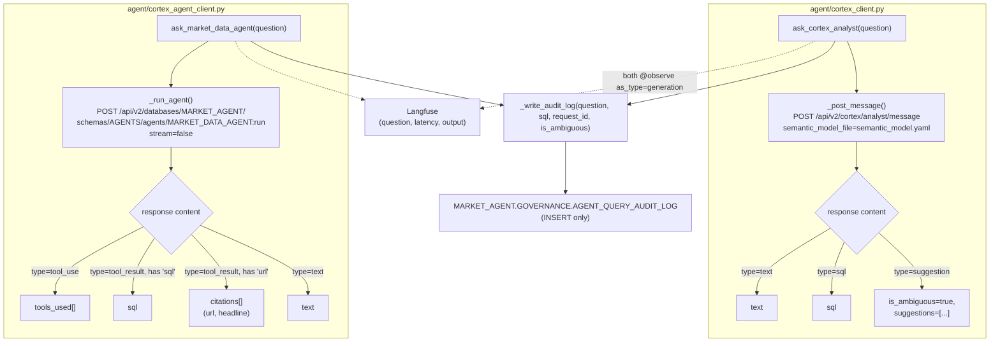
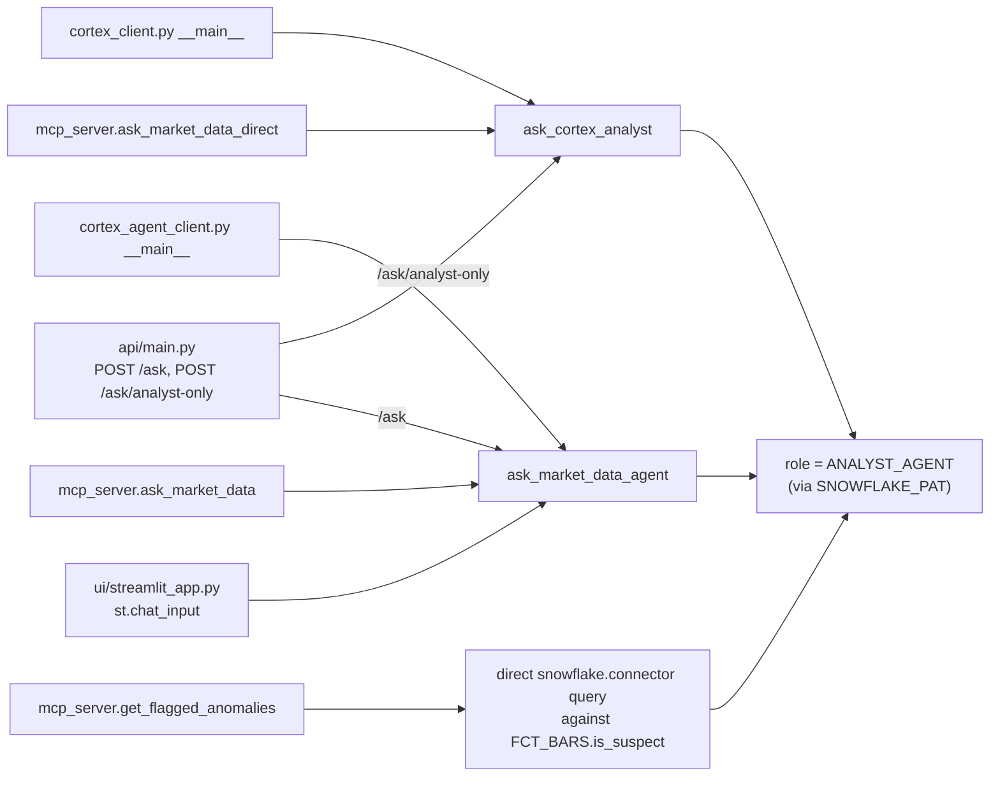
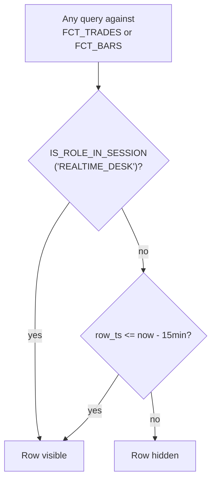

# Agent query and governance — deep dive

Linked from the main [README](../README.md#5-agent-query-and-governance). This
covers the two ways a question reaches Snowflake, the five things that can
ask a question, and the policy that gates all of them regardless of entry
point.

## Two call paths

`_write_audit_log` is defined once in `cortex_client.py` and imported by
`cortex_agent_client.py` (`from cortex_client import _write_audit_log,
_headers`) — both call paths share the exact same audit function and Snowflake
connection logic, so there's one place that can get the audit write wrong,
not two.

*Failure handling*: `_write_audit_log` wraps the `snowflake.connector.connect`
+ `INSERT` in a bare `try`/`except Exception`, logging at `logger.exception`
(`ERROR` level) and returning normally — a broken audit path never raises
into `ask_cortex_analyst` or `ask_market_data_agent`, so a user-facing
question never fails because logging it failed. This was a deliberate
choice, not an oversight: the alternative (raise on audit failure) would mean
an unrelated Snowflake connection problem could block every question in the
app.

---

## Five entry points, one governed path

Every box on the left ends up authenticating as the same `ANALYST_AGENT`
role — via the same `SNOWFLAKE_PAT` environment variable read in
`cortex_client._headers()` (used by both REST clients) and in
`mcp_server.get_flagged_anomalies` (used directly with
`snowflake.connector.connect`). None of the five entry points has its own
notion of a user or a permission level; whatever `ANALYST_AGENT` can and
cannot see is what every one of them can and cannot see.

**Note on `mcp_server.py`'s docstring**: it says *"ask_market_data and
search_market_news go through the Cortex Agent / Cortex Search"* — but there
is no `search_market_news` tool defined in the file; the three real tools are
`ask_market_data`, `ask_market_data_direct`, and `get_flagged_anomalies`.
Search happens only indirectly, as one of the two tools the Cortex Agent
itself may choose to invoke inside `ask_market_data`. This is a real
docstring/code mismatch — see `docs/restructure-proposal.md`.

---

## Where governance actually lives

This is `DELAYED_DATA_POLICY` (`sql/07_governance/rbac_and_masking.sql`),
attached to `FCT_TRADES.trade_ts` and `FCT_BARS.bar_ts` with `ALTER TABLE ...
ADD ROW ACCESS POLICY`. It runs inside Snowflake, underneath the Semantic
View, underneath Cortex Analyst, underneath the Cortex Agent — so it applies
the same way whether the query came from Snowsight, one of the five entry
points above, or a future client nobody has written yet. `ANALYST_AGENT` is
never granted `REALTIME_DESK`, so every path in this document is permanently
on the "15-minute delayed" branch unless someone deliberately re-grants that
role.

**Blast-radius limits sit next to the policy, not inside it**: every query
that reaches `Role` above is also running on `ANALYST_WH` (`STATEMENT_TIMEOUT_IN_SECONDS
= 30`) under `ANALYST_AGENT_MONITOR` (a monthly credit quota that suspends
the warehouse at 100%). Neither of those is a data-access rule — they bound
cost and runaway-query risk, which is a different failure mode than a wrong
or malicious question, and both are described in `sql/09_guardrails/cost_and_access_guardrails.sql`.

**Status: Stubbed** — the policy, the roles, the warehouse, and the resource
monitor are all written and internally consistent, but none has been applied
against a live Snowflake account, so this document describes intended
behavior rather than observed behavior.
